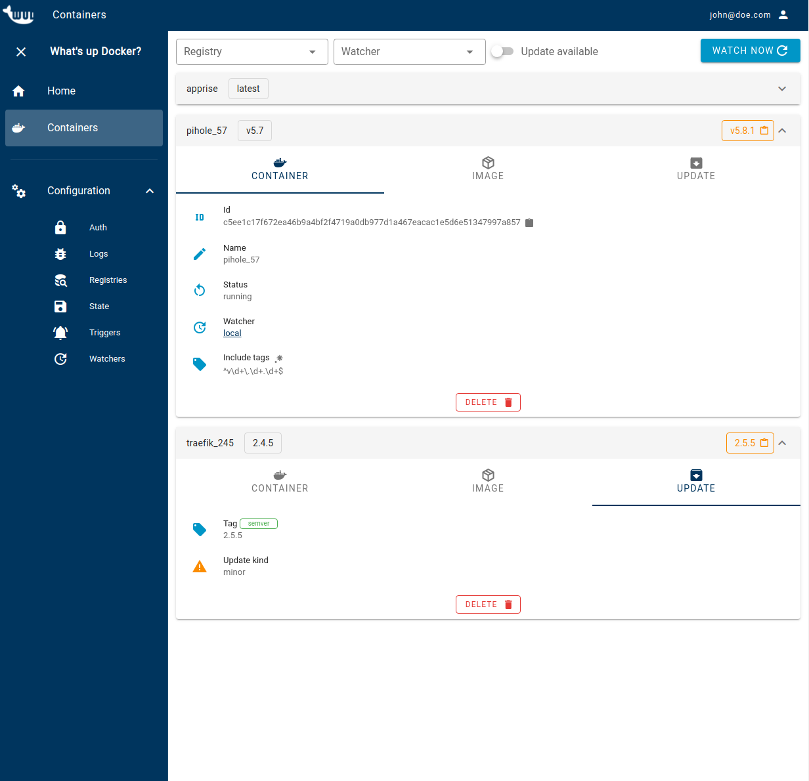

# Dashboard
Gets you notified when new versions of your Docker containers are available and lets you react the way you want.

#### WUD is built on 3 concepts:

> `WATCHERS` query your Docker hosts to get the containers to watch

> `REGISTRIES` query the Docker registries to find available updates

> `TRIGGERS` perform actions when updates are available

## Dashboard Office Interface

