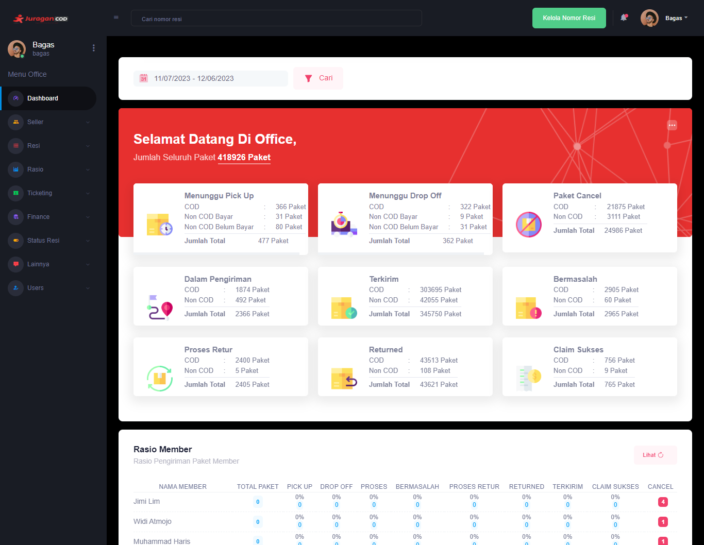

### Dashboard

Dashboard dirancang untuk memberikan visibilitas dan kontrol yang efektif terhadap berbagai aspek operasional perusahaan. Berikut adalah beberapa komponen yang dapat ditemukan dalam dashboard admin Office JuraganCOD:

### Halaman Dashboard Office

Halaman utama menampilkan ucapan selamat datang sekaligus menampilkan informasi jumlah keseluruhan paket yang telah melakukan transaksi, informasi ini dapat difilter berdasarkan rentang waktu. Selain itu, terdapat rincian informasi lainnya, meliputi:

- <b>Menunggu Pickup</b>: Paket yang sedang menunggu untuk diambil oleh kurir ekspedisi
- <b>Menunggu Drop Off</b>: Paket yang sedang menunggu untuk diantarkan oleh penjual ke lokasi ekspedisi
- <b>Paket Cancel</b>: Paket yang dibatalkan atau tidak akan diantar ke penerima
- <b>Dalam Pengiriman</b>: Paket yang sedang dalam perjalanan menuju lokasi penerima
- <b>Terkirim</b>: Paket yang berhasil sampai ke lokasi penerima
- <b>Bermasalah</b>: Paket yang mengalami masalah selama proses pengiriman
- <b>Proses Retur</b>: Paket yang sedang dalam proses pengembalian atau retur
- <b>Returned</b>: Paket yang telah berhasil dikembalikan
- <b>Claim Sukses</b>: Paket yang berhasil melakukan klaim, biasanya berupa klaim atas jumlah uang

Selain itu, terdapat ringkasan informasi mengenai fitur-fitur lain, seperti Rasio Member, Monitoring Seller, dan List Resi, yang telah dijelaskan secara rinci pada masing-masing menu dan dapat diakses melalui menu sidebar.

