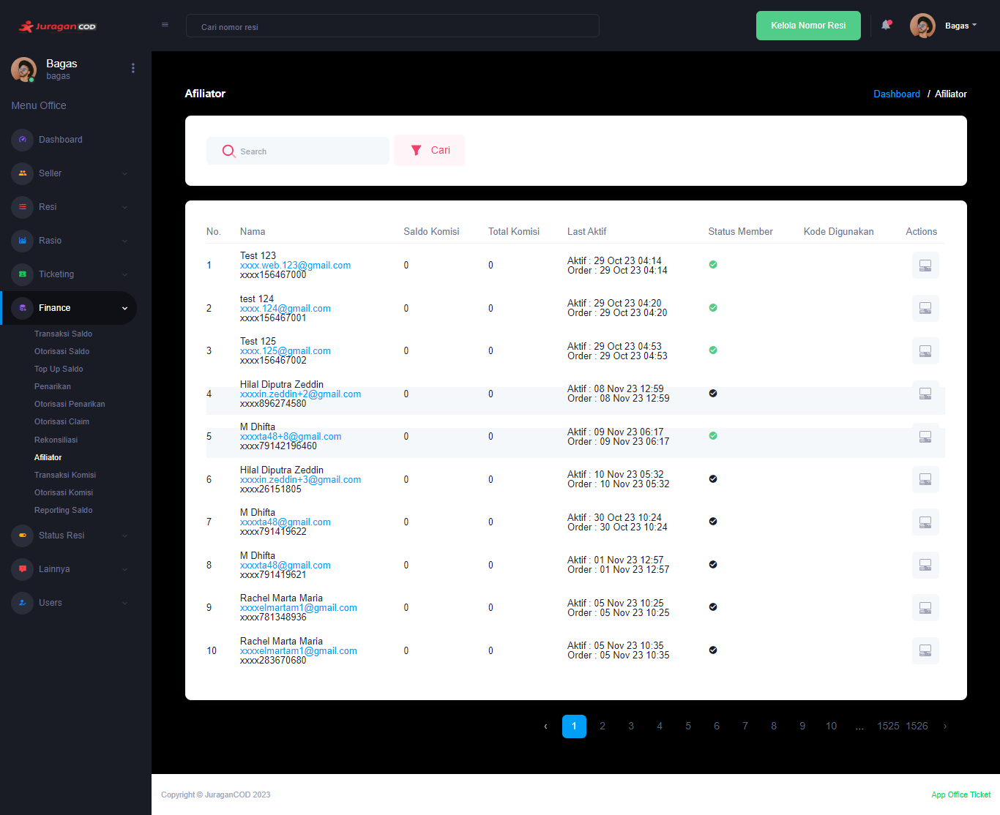

### Affiliator

Fitur <b>_Affiliator_</b> memungkinkan admin office untuk melakukan pengelolaan pada daftar akun Affiliator yang ada

### Halaman Utama Affiliator

Halaman akan menampilkan daftar Affiliator, berikut informasi detailnya:  

- <b>Nama</b>: Informasi mengenai akun affiliator terkait
- <b>Saldo Komisi</b>: Informasi mengenai saldo komisi yang didapat
- <b>Total Komisi</b>: Informasi mengenai total keseluruhan hasil dari melakukan affiliasi
- <b>Last Aktif</b>: Informasi tentang kapan terakhir kali akun affiliator aktif
- <b>Status Member</b>: Informasi status keanggotaan, apakah aktif atau tidak aktif
- <b>Kode Digunakan</b>: Kode affiliasi/referal yang digunakan saat mendaftar akun
- <b>Action</b>: Aksi yang dapat dilakukan oleh admin kantor pada akun Affiliator

