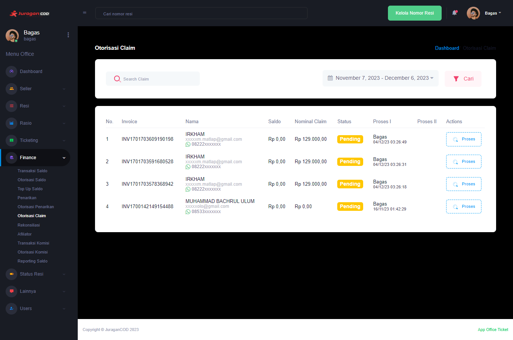
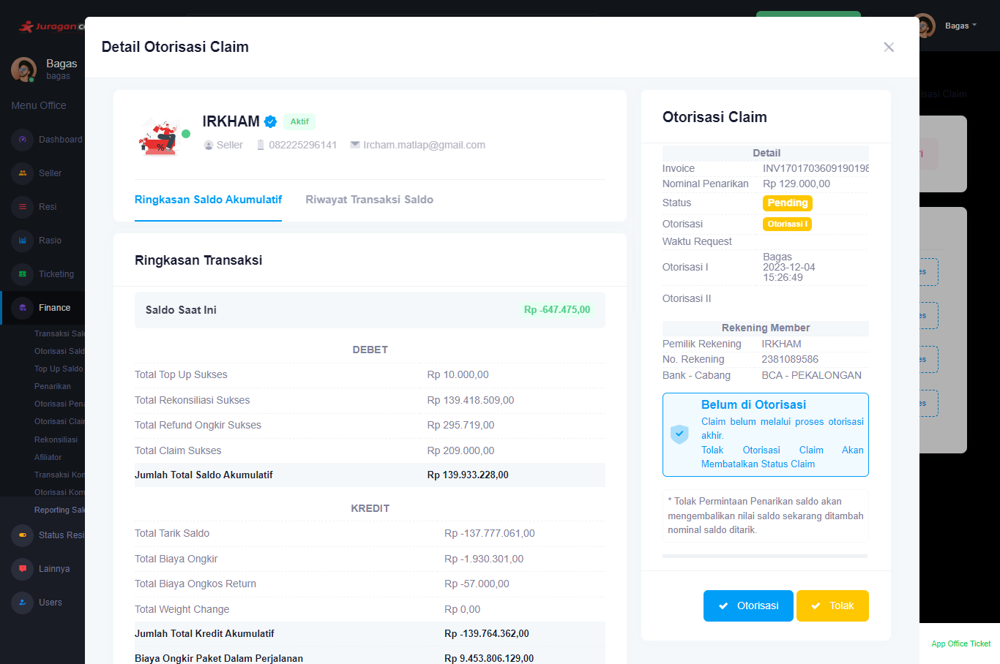

### Otorisasi Claim

Fitur <b>_Otorisasi Claim_</b> memungkinkan admin office melakukan proses terhadap permintaan otorisasi claim oleh seller.

### Halaman Utama Otorisasi Claim

Halaman akan menampilkan daftar Otorisasi Claim, berikut informasi detailnya:  

- <b>Invoice</b>: Informasi kode unik invoice Otorisasi Claim dan waktu dilakukannya transaksi
- <b>Nama</b>: Informasi akun yang melakukan Otorisasi Claim
- <b>Saldo</b>: Jumlah uang yang dimiliki seller pada akun di platform JuraganCOD.com
- <b>Nominal Claim</b>: Jumlah nominal claim yang diajukan oleh seller
- <b>Status</b>: Kondisi yang mengacu pada informasi terbaru apakah Otorisasi Claim berhasil dilakukan, sedang diproses, ataukah gagal
- <b>Proses I</b>: Proses validasi yang dilakukan oleh Staff sebelum akhirnya divalidasi oleh Manager. Terdapat informasi Staff yang melakukan proses tersebut.
- <b>Proses II</b>: Proses validasi yang dilakukan oleh Manager sebelum akhirnya pihak finance melakukan transfer ke nomor rekening seller. Terdapat informasi Manager yang melakukan proses tersebut.
- <b>Action</b>: Aksi yang dapat dilakukan office pada daftar Otorisasi Claim

Pihak admin office dapat melakukan otorisasi claim dengan mengklik tombol pada kolom action dengan nama <b>Proses</b>, maka akan dialihkan ke sebuah modal baru berisi Detail Otorisasi Claim.

Terdapat informasi yang lebih detail, seperti jumlah debet dan kredit. Pihak admin office dapat menyetujui claim dengan mengklik tombol <b>Otorisasi</b> atau dapat menolak dengan mengklik tombol <b>Tolak</b>

