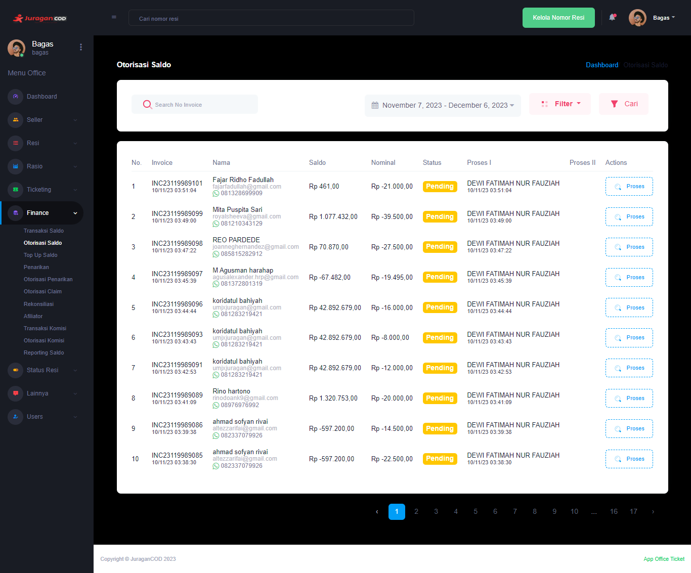

### Otorisasi Saldo

Fitur <b>_Otorisasi Saldo_</b> memungkinkan admin office melakukan proses

### Halaman Utama Otorisasi Saldo

Halaman akan menampilkan daftar Otorisasi Saldo, berikut informasi detailnya:  

- <b>Invoice</b> adalah informasi kode unik invoice Otorisasi Saldo dan waktu dilakukannya transaksi
- <b>Nama</b> adalah informasi akun yang melakukan Otorisasi Saldo
- <b>Saldo</b> adalah jumlah uang yang dimiliki seller pada akun di platform JuraganCOD.com
- <b>Nominal</b> adalah jumlah uang akan ditarik oleh seller
- <b>Status</b> adalah kondisi yang mengacu pada informasi terbaru apakah otorisasi berhasil dilakukan, sedang diproses, ataukah gagal
- <b>Proses I</b> adalah proses validasi yang dilakukan oleh Staff sebelum akhirnya divalidasi oleh Manager, terdapat informasi Staff yang melakukan proses tersebut
- <b>Proses II</b> adalah proses validasi yang dilakukan oleh Manager sebelum akhirnya pihak finance melakukan transfer ke nomor rekening seller
- <b>Action</b> adalah aksi yang dapat dilakukan office pada Otorisasi Saldo

