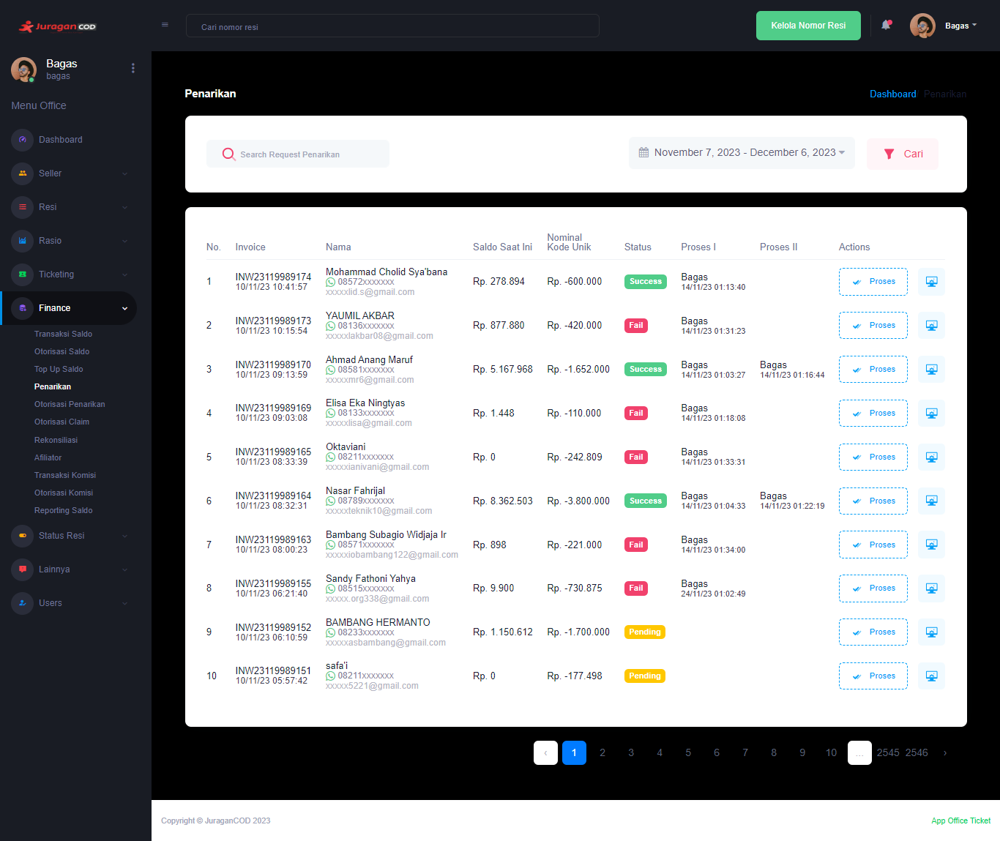

### Penarikan

Fitur <b>_Penarikan_</b> memungkinkan admin office melakukan proses

### Halaman Utama Penarikan

Halaman akan menampilkan daftar Penarikan, berikut informasi detailnya:  

- <b>Invoice</b> adalah informasi kode unik invoice penarikan dan waktu dilakukannya transaksi
- <b>Nama</b> adalah informasi akun yang melakukan penarikan
- <b>Saldo Saat Ini</b> adalah jumlah uang yang dimiliki seller pada akun di platform JuraganCOD.com
- <b>Nominal Kode Unik</b> adalah jumlah uang akan ditarik oleh seller
- <b>Status</b> adalah kondisi yang mengacu pada informasi terbaru apakah Penarikan berhasil dilakukan, sedang diproses, ataukah gagal
- <b>Proses I</b> adalah proses validasi yang dilakukan oleh Staff sebelum akhirnya divalidasi oleh Manager, terdapat informasi Staff yang melakukan proses tersebut
- <b>Proses II</b> adalah proses validasi yang dilakukan oleh Manager sebelum akhirnya pihak finance melakukan transfer ke nomor rekening seller, terdapat informasi Manager yang melakukan proses tersebut
- <b>Action</b> adalah aksi yang dapat dilakukan office pada Penarikan

