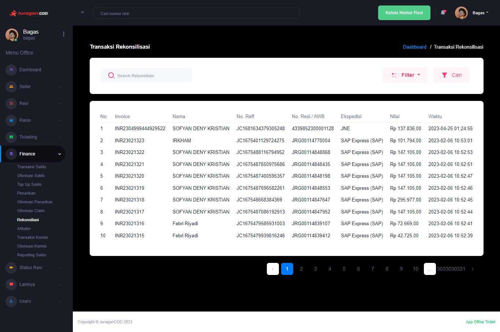

### Rekonsiliasi

Fitur <b>_Rekonsiliasi_</b> memungkinkan admin office melakukan proses

<!-- ### Halaman Utama Rekonsiliasi

Halaman akan menampilkan daftar Rekonsiliasi, berikut informasi detailnya:  

- <b>Invoice</b>: Informasi kode unik invoice Rekonsiliasi dan waktu dilakukannya transaksi
- <b>Nama</b>: Informasi akun yang melakukan Rekonsiliasi
- <b>No. Reff</b>: informasi nomor refferensi
- <b>No. Resi/AWB</b>: Informasi mengenai nomor resi/awb
- <b>Ekspedisi</b>:
- <b>Nilai</b>: Jumlah uang
- <b>Waktu</b>: Waktu terjadinya rekonsiliasi

 -->
