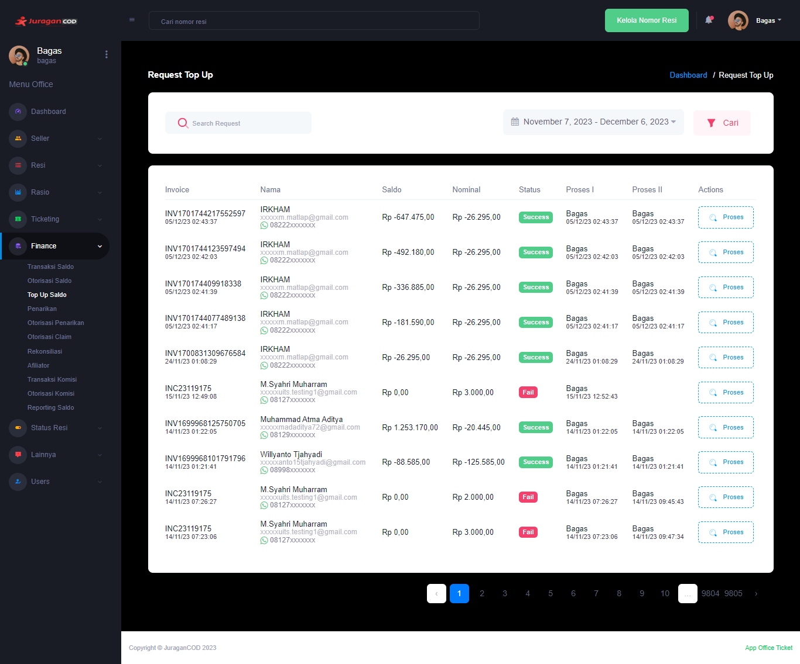

### Top Up

Fitur <b>_Top Up_</b> memungkinkan admin office melakukan proses top up saldo seller.

### Halaman Utama Top Up

Halaman ini menampilkan daftar Top Up, berserta informasi detailnya:  

- <b>Invoice</b>: Kode unik invoice Top Up dan waktu dilakukannya transaksi
- <b>Nama</b>: Informasi akun yang melakukan Top Up
- <b>Saldo</b>: Jumlah uang yang dimiliki seller pada akun di platform JuraganCOD.com
- <b>Nominal</b>: Jumlah uang yang akan ditop up oleh seller
- <b>Status</b>: Kondisi yang mengacu pada informasi terbaru, apakah top up berhasil dilakukan, sedang diproses, atau gagal
- <b>Proses I</b>: ses validasi yang dilakukan oleh Staff sebelum akhirnya divalidasi oleh Manager. Terdapat informasi Staff yang melakukan proses tersebut
- <b>Proses II</b>: Proses validasi yang dilakukan oleh Manager sebelum akhirnya pihak finance melakukan transfer ke nomor rekening seller. Terdapat informasi Manager yang melakukan proses tersebut
- <b>Action</b>: Aksi yang dapat dilakukan oleh admin office pada transaksi Top Up.

