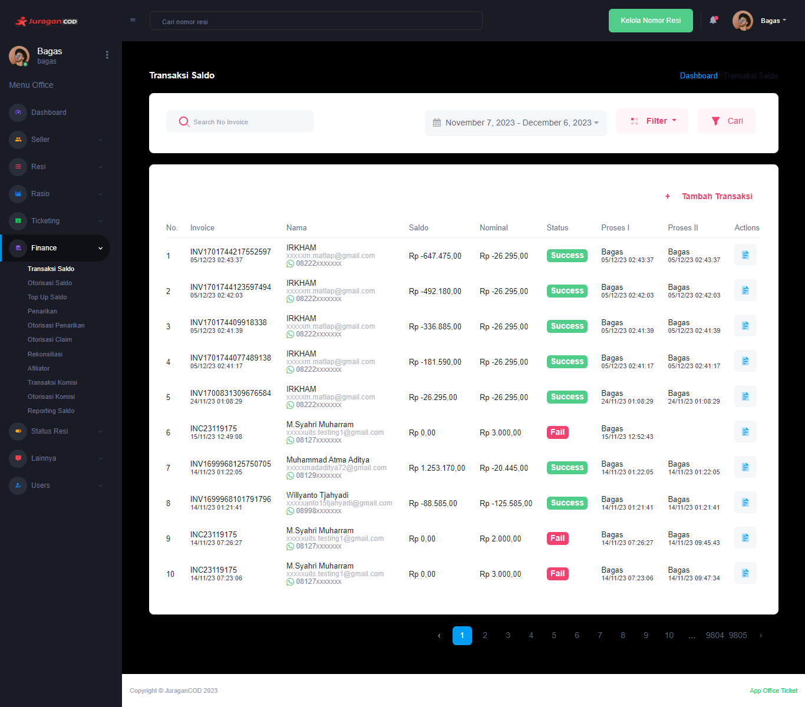

### Transaksi Saldo

Fitur <b>_Transaksi Saldo_</b> memungkinkan admin office melakukan proses pengiriman saldo kepada seller, melalui beberapa proses antara lain:  

- Proses I : Proses validasi oleh Staff
- Proses II : Proses validasi oleh Manager

### Halaman Utama Transaksi Saldo

Halaman akan menampilkan daftar Transaksi Saldo, berikut informasi detailnya:  

- <b>Invoice</b>: Kode unik invoice transaksi saldo dan waktu dilakukannya transaksi
- <b>Nama</b>: Informasi akun yang melakukan transaksi saldo
- <b>Saldo</b>: Jumlah uang yang dimiliki seller pada akun di platform JuraganCOD.com
- <b>Nominal</b>: Jumlah uang yang akan ditarik oleh seller
- <b>Status</b>: Kondisi yang mengacu pada informasi terbaru, apakah transaksi berhasil dilakukan atau gagal
- <b>Proses I</b>: Proses validasi yang dilakukan oleh Staff sebelum akhirnya divalidasi oleh Manager
- <b>Proses II</b>: Proses validasi yang dilakukan oleh Manager sebelum akhirnya pihak finance melakukan transfer ke nomor rekening seller
- <b>Action</b>: Aksi yang dapat dilakukan office pada transaksi saldo

