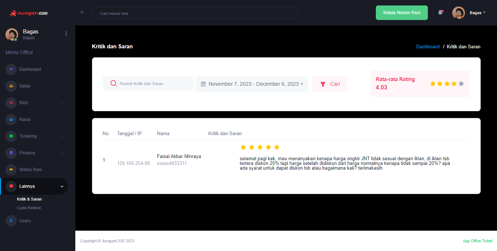

### Kritik dan Saran

Fitur <b>_Kritik dan Saran_</b> dapat digunakan oleh pihak admin office untuk melihat, meninjau, dan mengelola Kritik dan Saran dari seller pengguna [JuraganCOD.com](https://juragancod.com)

### Halaman Kritik dan Saran

Pada halaman ini akan ditampilkan komentar Kritik dan Saran dari pengguna platform [JuraganCOD.com](https://juragancod.com), admin Office dapat melakukan filterisasi komentar berdasarkan rentang tanggal dan rating. Fitur ini memungkinkan untuk menyaring komentar agar lebih mudah dikelola dan menganalisis feedback dari pengguna platform.

Berikut adalah informasi detailnya:

- <b>Tanggal/IP</b>: Informasi tanggal pembuatan komentar dan alamat IP akun tersebut
- <b>Nama</b>: Informasi akun yang memberikan Kritik dan Saran
- <b>Kritik dan Saran</b>: Komentar yang diberikan pengguna kepada Juragancod, dapat berupa pengalaman pengguna, keluhan, saran untuk perbaikan, maupun feedback terhadap proses pengiriman barang

