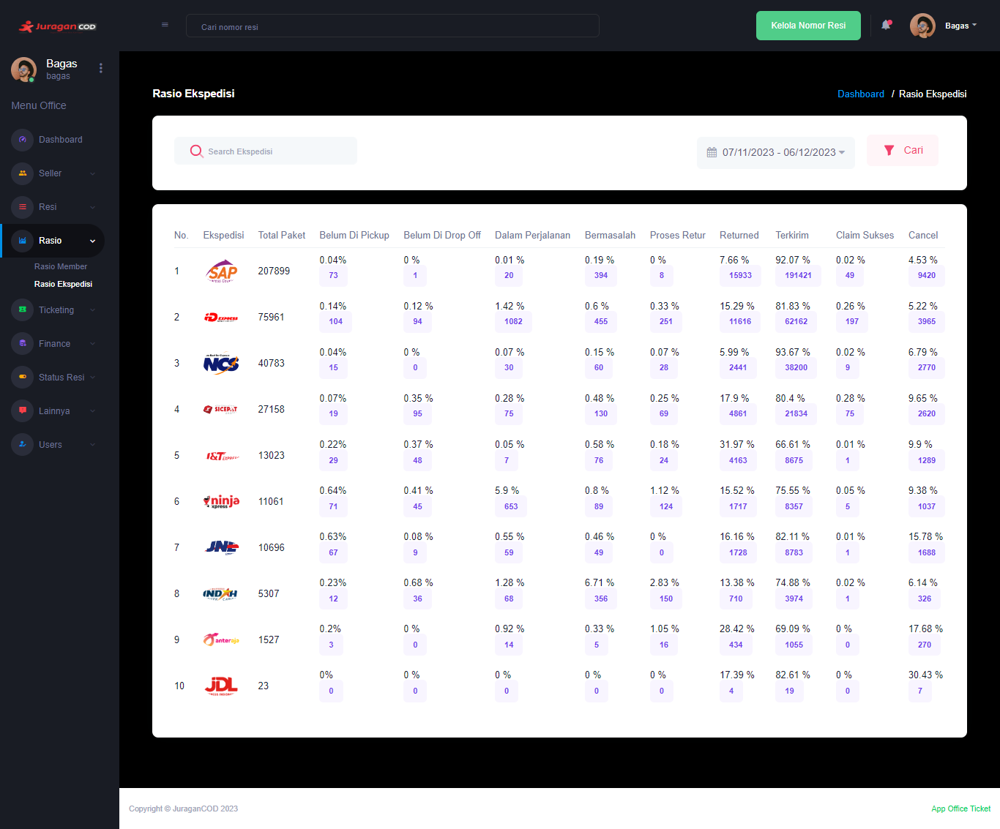

### Rasio Ekspedisi

<b>_Rasio Ekspedisi_</b> memberikan informasi mengenai transaksi pengiriman paket yang dilakukan oleh member terhadap masing-masing ekspedisi. Contohnya seperti jumlah paket yang menggunakan ekspedisi IDExpress, jumlah paket yang melakukan pembatalan pada ekspedisi Sicepat, dan sebagainya.

### Halaman Utama Rasio Ekspedisi

Halaman ini menampilkan data transaksi pengiriman pada masing-masing ekspedisi, beserta informasi detailnya:  

- <b>Ekspedisi</b>: Informasi mengenai ekspedisi terkait
- <b>Total Paket</b>: Jumlah total keseluruhan pengiriman paket yang dilakukan pada ekspedisi tersebut.
- <b>Belum Di Pickup</b>: Persentase dan jumlah paket yang belum diambil oleh ekspedisi
- <b>Belum Di Drop Off</b>: Persentase dan jumlah paket yang belum didrop off oleh seller ke lokasi ekspedisi
- <b>Dalam Perjalanan</b>: Persentase dan jumlah paket yang sedang dalam perjalanan
- <b>Paket Bermasalah</b>: Persentase dan jumlah paket yang mengalami masalah
- <b>Proses Retur</b>: Persentase dan jumlah paket yang sedang dalam proses retur
- <b>Returned</b>: Persentase dan jumlah paket yang berhasil dikembalikan
- <b>Terkirim</b>: Persentase dan jumlah paket yang telah berhasil terkirim kepada penerima
- <b>Claim Sukses</b>: Persentase dan jumlah paket yang berhasil mengklaim kerusakan barang
- <b>Cancel</b>: Persentase dan jumlah paket yang melakukan pembatalan order

