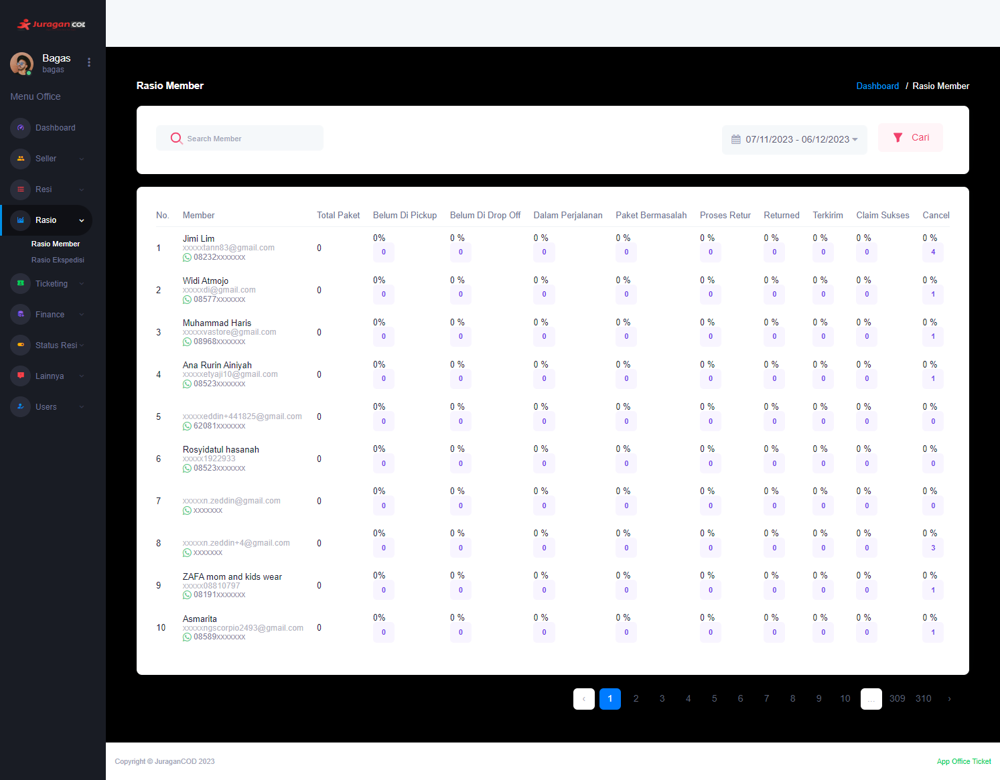

### Rasio Member

<b>_Rasio Member_</b> memberikan informasi mengenai transaksi paket yang dilakukan oleh member, mencakup total paket, paket yang sedang dalam perjalanan, paket sukses terkirim, paket yang dibatalkan, dan sebagainya

### Halaman Utama Rasio Member

Halaman ini menampilkan data transaksi yang dilakukan oleh member dalam bentuk rasio, bersama dengan informasi detailnya:  

- <b>Member</b>: Informasi mengenai identitas seller, termasuk email dan nomor Whatsapp.
- <b>Total Paket</b>: Jumlah total keseluruhan pengiriman paket yang dilakukan oleh seller.
- <b>Belum Di Pickup</b>: Persentase dan jumlah paket yang belum diambil oleh kurir ekspedisi.
- <b>Belum Di Drop Off</b>: Persentase dan jumlah paket yang belum diantar oleh seller ke lokasi ekspedisi
- <b>Dalam Perjalanan</b>: Persentase dan jumlah paket yang sedang dalam perjalanan
- <b>Paket Bermasalah</b>: Persentase dan jumlah paket yang mengalami masalah
- <b>Proses Retur</b>: Persentase dan jumlah paket yang sedang dalam proses retur
- <b>Returned</b>: Persentase dan jumlah paket yang berhasil dikembalikan/retur
- <b>Terkirim</b>: Persentase dan jumlah paket yang telah berhasil terkirim kepada penerima
- <b>Claim Sukses</b>: Persentase dan jumlah paket yang berhasil mengklaim kerusakan barang
- <b>Cancel</b>: Persentase dan jumlah paket yang melakukan pembatalan order

