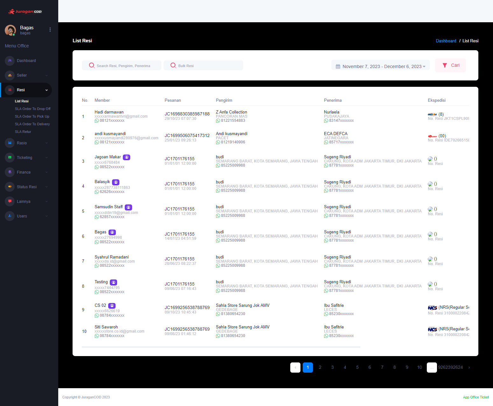

### List Resi

<b>_List Seller_</b> merupakan fitur yang menampilkan seluruh resi yang telah melakukan transaksi pada platform [JuraganCOD.com](https://juragancod.com)

### Halaman Utama List Resi

Halaman ini menampilkan data resi yang terdaftar pada JuraganCOD, beserta dengan informasi detail lainnya seperti:  

- <b>Member</b>: Informasi mengenai akun yang melakukan transaksi order
- <b>Pesanan</b>: Informasi nomor resi pesanan dan waktu dilakukannya transaksi
- <b>Pengirim</b>: Informasi mengenai pengirim paket, biasanya berupa nama perorangan atau nama toko pengirim
- <b>Penerima</b>: Informasi mengenai penerima paket
- <b>Ekspedisi </b>: Informasi mengenai ekspedisi yang dipilih oleh member untuk mengirim paket

