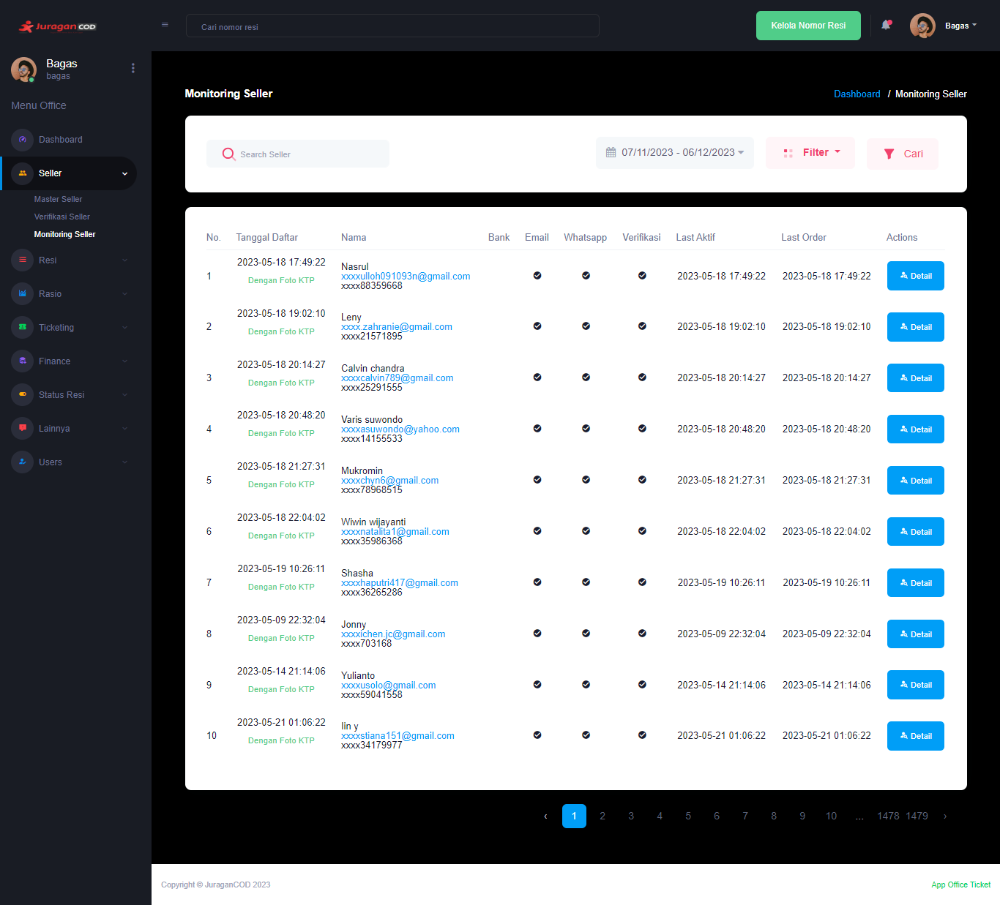

### Monitoring Seller

<b>_Monitoring Seller_</b> merupakan fitur yang digunakan untuk memonitor aktivitas seller pada platform JuraganCOD.

### Halaman Utama Monitoring Seller

Halaman akan menampilkan data Seller yang terdaftar pada JuraganCOD, berikut dengan informasi detail lainnya seperti:  

- <b>Tanggal Daftar</b> adalah informasi kapan pertama kali seller melakukan pendaftaran akun di [JuraganCOD.com](https://juragancod.com)
- <b>Nama</b> berisi informasi identitas seller beserta email dan nomor Whatsapp
- <b>Bank</b> adalah rekening bank utama yang digunakan seller
- <b>Email</b> adalah informasi konektivitas akun dengan email
- <b>Whatsapp</b> adalah informasi konektivitas akun dengan Whatsapp
- <b>Verifikasi</b> adalah informasi apakah akun telah terverifikasi
- <b>Last Aktif</b> adalah infromasi kapan terakhir kali akun seller aktif
- <b>Last Order</b> adalah informasi kapan terakhir kali seller melakukan order
- <b>Action</b> adalah aksi yang dapat dilakukan office pada akun seller, anda dapat mengklik tombol <b>Detail</b> untuk melakukan aksi.

