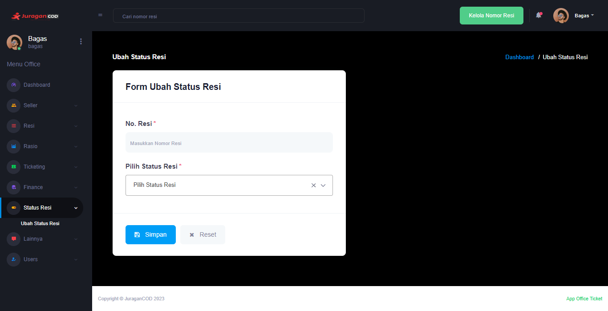

# Status Resi

Fitur <b>_Status Resi_</b> digunakan oleh pihak Office untuk melakukan pembaruan atau perubahan pada status pengiriman atau nomor resi paket.

## Cara Ubah Status Resi

- Klik <b>Status Resi > Ubah Status Resi</b> pada menu sidebar
- Terdapat form yang perlu anda isi, yaitu:  
  <b>No Resi</b> yaitu nomor resi yang akan diubah status pengirimannya  
  <b>Pilih Status Resi</b> berisi pilihan status pengiriman resi yang dapat anda pilih sesuai kondisi paket
- Klik tombol <b>Simpan</b> untuk menyimpan perubahan status resi
  
