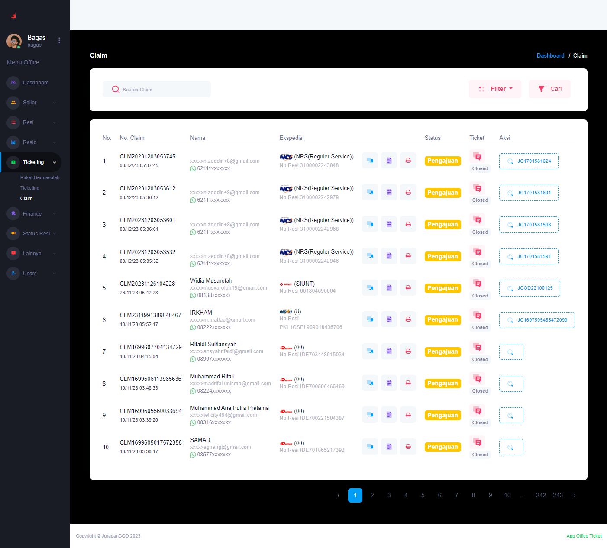

### Claim

<b>_Claim_</b> berisi informasi mengenai resi paket yang mengajukan claim breach atau klaim kerusakan paket.

### Halaman Utama Claim

Halaman ini menampilkan daftar nomor resi yang mengajukan Claim, berserta informasi detailnya:  

- <b>No. Claim</b>: Kode unik pengajuan klaim
- <b>Nama</b>: Informasi mengenai akun yang melakukan claim breach
- <b>Ekspedisi </b>: Informasi mengenai ekspedisi yang melakukan pengantaran paket
- <b>Status</b>: Kondisi yang mengacu pada informasi terbaru, apakah klaim telah diproses, diajukan, atau selesai.
- <b>Ticket</b>: Digunakan untuk berkomunikasi dengan seller yang mengajukan claim
- <b>Action</b>: Aksi yang dapat dilakukan admin office pada resi yang bermasalah, terdapat juga informasi nomor resi paket.

