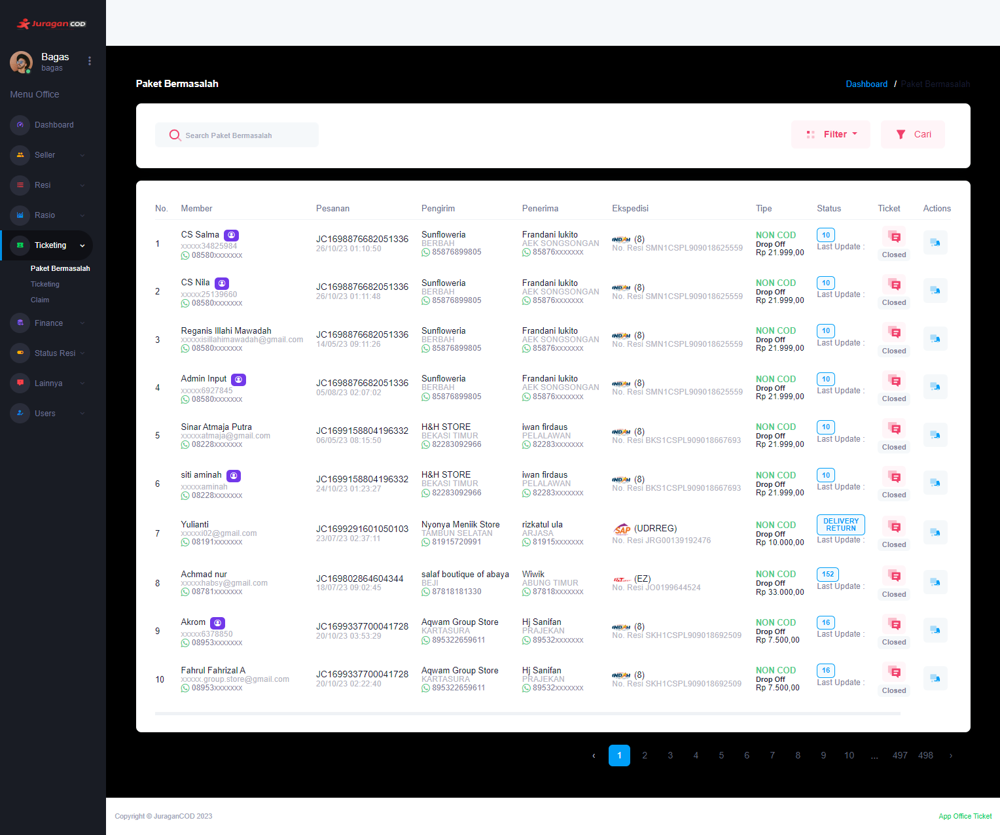

### Paket Bermasalah

<b>_Paket Bermasalah_</b> berisi informasi mengenai resi paket yang bermasalah. Paket bermasalah akan dicek secara otomatis dan berkala oleh worker, seller pemilik paket yang bermasalah dapat berkomunikasi dengan office dan melakukan claim kerusakan paket.

### Halaman Utama Paket Bermasalah

Halaman akan menampilkan daftar Paket Bermasalah, berikut informasi detailnya:  

- <b>Member</b> adalah informasi akun yang melakukan transaksi order
- <b>Pesanan</b> adalah informasi nomor resi pesanan dan waktu dilakukannya transaksi
- <b>Pengirim</b> adalah informasi pengirim paket, biasanya berupa nama perorangan atau nama toko pengirim
- <b>Penerima</b> adalah informasi penerima paket
- <b>Ekspedisi </b> adalah ekspedisi yang dipilih member untuk mengirim paket
- <b>Tipe</b> adalah informasi tipe pembayaran dan pengiriman paket.  
  Tipe pembayaran ada 2, yaitu COD dan Non-COD. Tipe pengiriman ada 2, yaitu Pick Up dan Drop Off
- <b>Status</b> adalah kondisi yang mengacu pada informasi terbaru yang menggambarkan paket tersebut berada
- <b>Ticket</b> dapat digunakan untuk berkomunikasi dengan seller yang memiliki paket bermasalah, seller dapat melakukan claim kerusakan paket pada menu Ticket tersebut
- <b>Action</b> adalah aksi yang dapat dilakukan office pada resi yang bermasalah.

