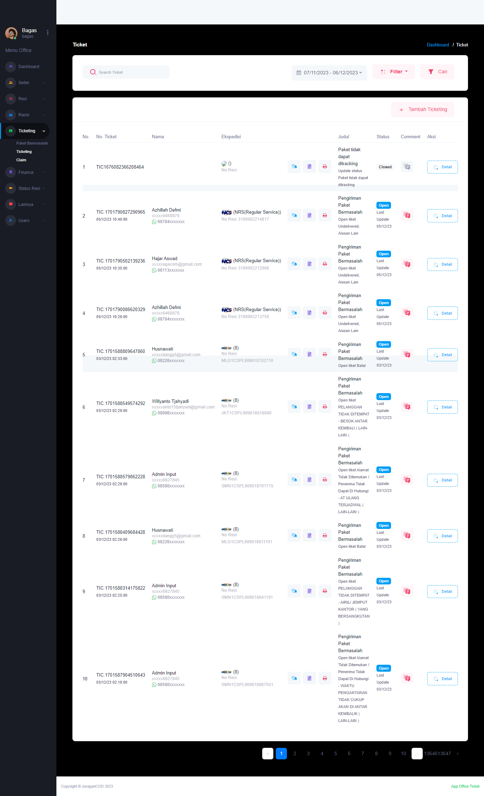

### Ticketing

<b>_Ticketing_</b> adalah fitur yang memungkinkan seller atau pihak yang akan mengajukan klaim untuk membuat permintaan resmi atau ticket yang akan diproses oleh tim Office JuraganCOD untuk menyelesaikan masalah pada paket bermasalah tersebut.

### Halaman Utama Ticketing

Halaman akan menampilkan daftar Ticket yang telah dibuat, berikut informasi detailnya:  

- <b>No. Ticket</b> adalah kode unik pengajuan claim
- <b>Nama</b> adalah informasi akun yang mengajukan ticket
- <b>Ekspedisi</b> adalah ekspedisi yang melakukan pengantaran paket
- <b>Judul</b> adalah deskripsi informasi masalah yang terjadi pada paket
- <b>Status</b> adalah kondisi yang mengacu pada informasi terbaru yang menggambarkan paket tersebut, apakah ticket masih berjalan (Open) atau telah selesai (Closed)
- <b>Comment</b> dapat digunakan untuk berkomunikasi dengan seller pemilik ticket tersebut
- <b>Action</b> adalah aksi yang dapat dilakukan office pada ticket yang diajukan

